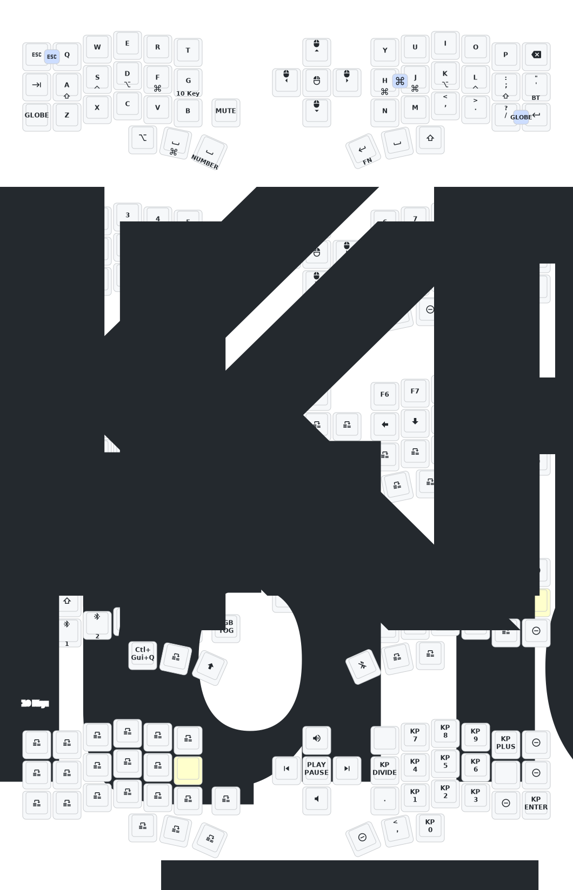

# Corne ZMK Repository

**This keyboard is not the same as [foostan's Corne](https://github.com/foostan/crkbd). It will not work with standard `corne` firmware.**

如果您需要该键盘的 3D 模型，请发送电子邮件至 `380465425@qq.com`。

## Instructions

1. [Fork this repository](https://docs.github.com/en/get-started/quickstart/fork-a-repo#forking-a-repository).
2. [Click the **Actions** tab and make sure the workflow is enabled](https://docs.github.com/en/actions/managing-workflow-runs-and-deployments/managing-workflow-runs/disabling-and-enabling-a-workflow#enabling-a-workflow).
3. Make sure the `eyelash_corne` project in [`config/west.yml`](config/west.yml) still works. The `boards/arm/eyelash_corne` folder will be downloaded from this URL.
4. If there is still a `boards/arm/eyelash_corne` folder in your fork, delete it.
5. Demo can take [Sofle Wireless setup](https://github.com/superxc3/zmk_config_sofle) as example.
6. Use [Keymap Editor](https://nickcoutsos.github.io/keymap-editor/) to remap easier. 

## Corne 键位图
**If you already have a ZMK config repository, [you can add this one as a module instead of forking](https://zmk.dev/docs/features/modules#building-with-modules).**

## Keymap Diagram

## Mouse Support

:warning: This repository defaults to an EXPERIMENTAL mouse movement branch which is slated for eventual merge into ZMK, but is not guaranteed to be stable. For more information, see [beta testing](https://zmk.dev/docs/features/modules#beta-testing) and [PR #2477](https://github.com/zmkfirmware/zmk/pull/2477).
